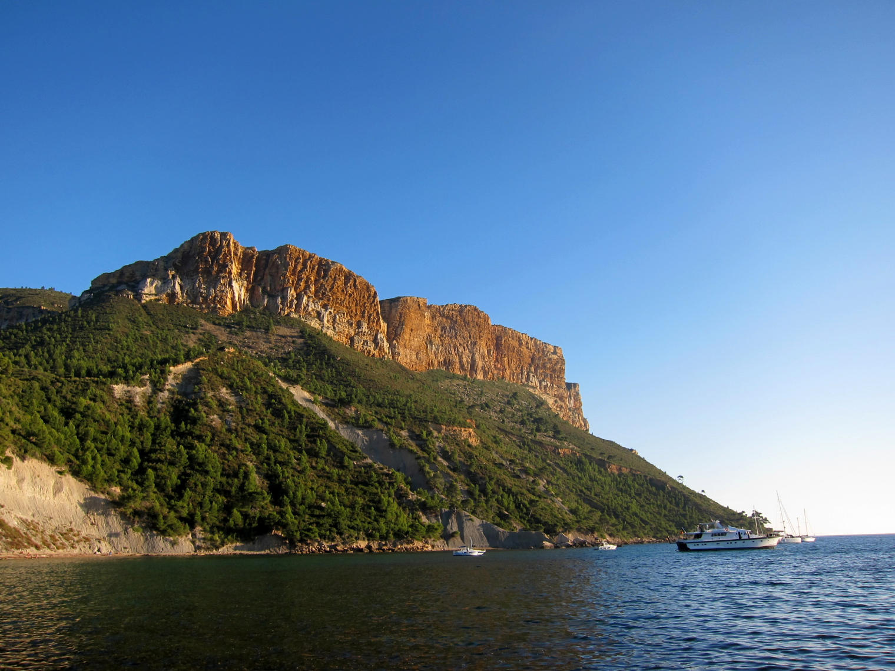
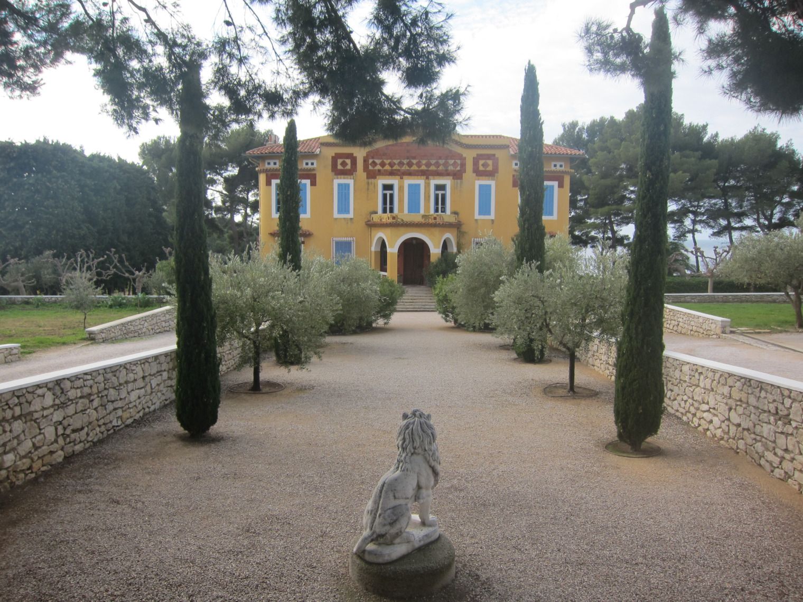

# Le vignoble Cassidain

Il y a 2600 ans, les Grecs plantent les premiers ceps suivi des Romains qui perpétuent la culture de la vigne en bord de mer.  

Le Vignoble de Cassis figure parmi les toutes premières appellations d’origine contrôlée en 1936 (avec Sauternes et Chateauneuf-du-Pape). Il est planté, et totalement intégré dans le Parc National, à l’abri du Cap Canaille, la plus haute falaise maritime de France, plongeant d’une hauteur de 400 mètres dans les flots de la Méditerranée.  

 {.full}

L’AOC Cassis est produit par 12 domaines dont les 200 ha de vignes sont exclusivement situés sur la commune de Cassis.
Les vendanges se font à la main. Le vignoble est protégé du mistral par la hauteur impressionnante des collines avoisinantes.  

Cassis cultive surtout le vin blanc. Trois bouteilles sur quatre s’élaborent dans cette couleur.  

## Le clos Sainte Magdeleine

Parmi les 12 vignobles, on trouve le clos Sainte Magdeleine.  

Le domaine s’étend sur près de vingt hectares, directement sur la mer et sur les flancs du Cap Canaille.  

 {.full}

Les parcelles dont l’âge moyen varie de 15 à 40 ans sont principalement plantés en “Restanques”.  

Il fut crée à la fin du XIXème siècle par Jules SAVON, ancien maire du village et appartient à la famille Zafiropulo depuis 1920.  

La culture, la plus naturelle et respectueuse de l’environnement possible, se base sur une approche en biodynamie du cycle de la vigne.  

Le domaine produit un vin blanc sec, floral et mentholé, offrant une bonne longueur aromatique relevée par des notes miellées, qui allie équilibre et caractère.  

Élevé en cuverie métallique, il est issu de cépages anciens, aux rendements strictement limités. Le blanc est la spécialité du domaine et représente environ 80% de la production totale.  

 {.full}

## Le petit plus : la cuve à vin ovoïde, en béton.

Dans la cave, à côté des cuves métalliques, on trouve des œufs géants, en béton. Ces cuves permettent un élevage des vins grâce au béton et à sa micro-porosité, sans les boiser, en respectant le fruit. De plus, les lies sont soulevées en permanence par un courant interne en forme de vortex.  

## Visites du domaine

L’équipe propose une visite commentée du domaine et de la cave suivie par une dégustation des vins. Cette visite oenotouristique ludique et complète vous permettra de découvrir l’histoire du domaine et le processus d’élaboration des vins.  

D’Avril à Septembre  
Du lundi au samedi, deux visites par jour, à 11h00 et à 16h00. 

Avenue du Revestel – 136260 Cassis – France  
Tél : +33 (0)4 42 01 70 28  
Fax : +33 (0)4 42 01 15 51

**Prix : 10 € par personne** (incluant la dégustation de deux vins).  

### Infos pratiques

Vous pouvez vous rendre à Cassis par le train, le bus ou en voiture (30 km de Marseille). Toutes les infos sur le site de l’Office de Tourisme de Cassis.  